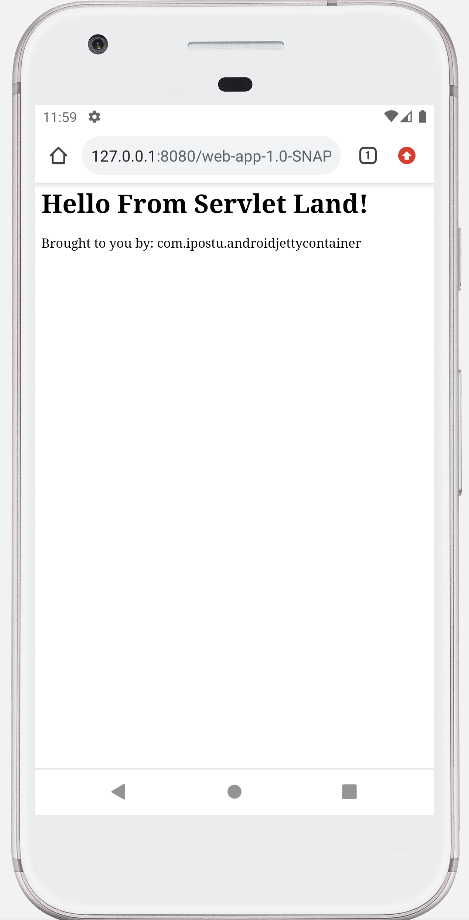

# APK Servlet Container



## Useful commands
```sh
$ $ANDROID_HOME/platform-tools/adb push ./webapp-parent/web-app/target/web-app-1.0-SNAPSHOT.war /storage/emulated/0/jetty/webapps/

$ $ANDROID_HOME/build-tools/34.0.0/dexdump -d ./classes.dex

# rebuild and deploy (requires manual restart)
$ mvnw install -f $PROJECT_DIR/webapp-parent/pom.xml && $ANDROID_HOME/platform-tools/adb push $PROJECT_DIR/webapp-parent/web-app/target/web-app-1.0-SNAPSHOT.war /storage/emulated/0/jetty/webapps/

# pair device through wifi
$ $ANDROID_HOME/platform-tools/adb pair host:port
```

## References:
- https://github.com/jetty-project/i-jetty
- https://github.com/jretty-org/jretty-server